# Building a Production-Grade Financial Knowledge Graph with LLMs: A Complete Guide

*From raw SEC filings to an AI-powered investigative copilot — how to combine Neo4j, ontologies, NLP, GNNs, and Large Language Models into a unified financial intelligence platform.*

---

## Why Financial Knowledge Graphs?

Financial data is inherently **relational**. A company *issues* instruments, which are *listed on* exchanges. Funds *own* stakes in companies. Filings *report on* entities. Events *affect* stock prices.

Traditional approaches store this in siloed tables and CSV files. When an analyst asks *"Show me the full ownership chain between BlackRock and Apple, including every intermediate entity and the regulatory filings that confirm each link"* — the answer requires joining across dozens of tables, resolving entity names, and reasoning over multi-hop paths. A relational database can technically answer this, but the query is painful to write and expensive to run.

**Knowledge Graphs** make these relationships first-class citizens. In Neo4j, that ownership chain is a simple traversal:

```cypher
MATCH path = (holder:LegalEntity {name: 'BLACKROCK INC.'})-[:OWNS*1..4]->(target:LegalEntity)
WHERE toLower(target.name) CONTAINS 'apple'
RETURN path
```

Add **Large Language Models** to the mix, and you get a system that can:
- **Extract** structured facts from unstructured filings automatically
- **Embed** entities for semantic similarity search
- **Generate** Cypher queries from natural language questions
- **Answer** investigative questions with citations and contradiction detection

This blog walks through building exactly that system — a 17-chapter journey from zero to a production financial KG with 3,976 nodes and 532 relationships, backed by real data from GLEIF, SEC EDGAR, OpenFIGI, and FIBO.

---

## Architecture Overview

The system is organized into six layers, each building on the one below:

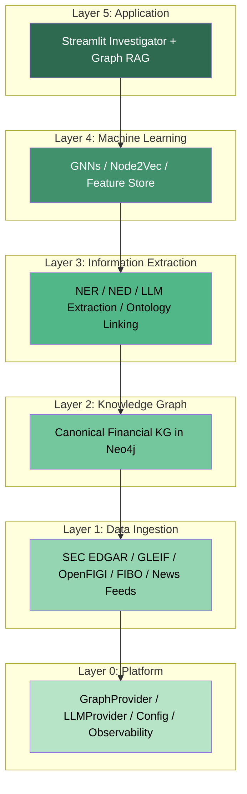

Each layer maps to specific chapters:

| Phase | Chapters | What You Build |
|-------|----------|----------------|
| **Foundation** | ch01–ch05 | Platform, prompts, ontology, multi-source graph, entity resolution |
| **Information Extraction** | ch06–ch10 | NLP, embeddings, LLM extraction, NED, benchmarking |
| **Graph ML** | ch11–ch14 | Node2Vec, features, GNN foundations, classification & link prediction |
| **Applications** | ch15–ch17 | Graph RAG, governance, investigative Streamlit app |

Let's walk through each phase.

---

## Phase 1: Foundation (ch01–ch05)

### ch01 — Platform Foundation

Every production system needs a clean abstraction layer. Instead of scattering Neo4j connection strings and API keys across 17 chapters, we centralize everything in a `_platform/` package:

```python
from ChaptersFinancial._platform.providers.graph import GraphProvider
from ChaptersFinancial._platform.providers.llm import LLMProvider

gp = GraphProvider()   # Reads bolt://localhost:7687 from config
llm = LLMProvider()    # Uses ollama, openai, azure, or mock
```

The `GraphProvider` is a thin wrapper around the Neo4j driver:

```python
class GraphProvider:
    def run(self, cypher: str, params: dict | None = None) -> list[dict]:
        with self.session() as s:
            return s.run(cypher, params or {}).data()
```

**Why this matters:** Every later chapter simply calls `gp.run(...)` without worrying about connection pools, database names, or credentials. Configuration lives in one YAML file:

```yaml
# provider_config.yaml
llm:
  default_provider: ollama
  ollama:
    model: deepseek-v3.2:cloud
    base_url: http://localhost:11434
graph:
  uri: bolt://localhost:7687
  user: neo4j
  database: neo4j
```

### ch01 — The Canonical Schema

Before loading any data, we define the shape of the graph. Think of this as the "schema" for a property graph — it's not enforced by Neo4j, but it's a contract that every importer follows.

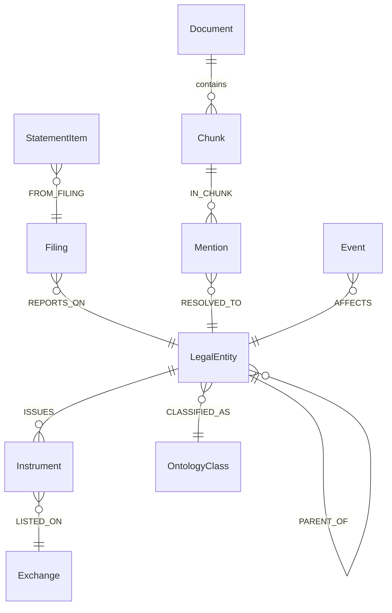

We enforce uniqueness constraints up front:

```python
constraints = [
    'CREATE CONSTRAINT legal_entity_lei IF NOT EXISTS FOR (le:LegalEntity) REQUIRE le.lei IS UNIQUE',
    'CREATE CONSTRAINT instrument_figi IF NOT EXISTS FOR (i:Instrument) REQUIRE i.figi IS UNIQUE',
    'CREATE CONSTRAINT exchange_mic IF NOT EXISTS FOR (e:Exchange) REQUIRE e.mic IS UNIQUE',
    # ... more constraints
]
for stmt in constraints:
    gp.run(stmt)
```

**Simple analogy:** Imagine you're building a Rolodex, but for the entire financial system. Each card (node) has a unique ID — LEI for companies, FIGI for instruments, MIC for exchanges. The colored strings connecting cards are relationships like OWNS, ISSUES, LISTED_ON.

---

### ch02 — Financial Prompting Foundations

Before we can use LLMs for extraction (ch08) or Graph RAG (ch15), we need to establish **how** we talk to them. This chapter sets up:

1. **JSON schemas** for structured output — every LLM response must match a predefined format
2. **Compliance guardrails** — reject prompts asking for price predictions or insider information

```python
FORBIDDEN_PATTERNS = [
    'predict.*price', 'stock.*tip', 'buy.*sell.*recommendation',
    'guaranteed.*return', 'insider.*information'
]

def check_input_safety(text: str) -> tuple[bool, str]:
    for pattern in FORBIDDEN_PATTERNS:
        if re.search(pattern, text, re.IGNORECASE):
            return False, f'Blocked: matches forbidden pattern "{pattern}"'
    return True, 'OK'

# Examples
check_input_safety("What are Apple's recent filings?")        # (True, 'OK')
check_input_safety("Predict AAPL stock price for next month")  # (False, 'Blocked: ...')
```

The `LLMProvider.complete_json()` method wraps the LLM call with automatic JSON parsing, retry on malformed responses (reflexion loop), and disk caching:

```python
result = llm.complete_json("""
    Extract all financial entities from this text as JSON.
    Return {"entities": [{"name": ..., "type": "ORG"|"PERSON"|"INSTRUMENT", "confidence": 0-1}]}
    Text: Apple Inc. reported Q3 2024 revenue of $85.8 billion.
""")
# Returns: {"entities": [{"name": "Apple Inc.", "type": "ORG", "confidence": 0.95}]}
```

---

### ch03 — Financial Ontology Bootstrapping

This is where the graph starts to get *smart*. Instead of just storing raw data, we import **formal ontologies** that define what things *mean* in finance.

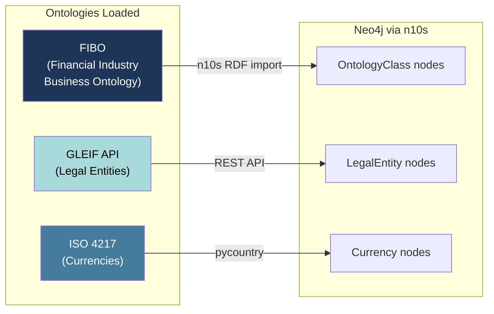

**Neosemantics (n10s)** is a Neo4j plugin that imports RDF/OWL/TTL ontologies directly into the property graph. FIBO — the Financial Industry Business Ontology — defines classes like `Corporation`, `LimitedLiabilityCompany`, `Fund`, and `Bank` as a formal hierarchy.

```python
# Initialize n10s for RDF import
gp.run("""
    CALL n10s.graphconfig.init({
        handleVocabUris: 'MAP',
        handleMultival: 'ARRAY',
        handleRDFTypes: 'LABELS_AND_NODES'
    })
""")

# Import FIBO Business Entities module
gp.run("""
    CALL n10s.rdf.import.fetch(
        'https://spec.edmcouncil.org/fibo/ontology/BE/MetadataBE/BEDomain',
        'RDF/XML'
    )
""")
```

We also pull **real legal entities** from GLEIF (the official LEI registry):

```python
resp = httpx.get(
    'https://api.gleif.org/api/v1/lei-records',
    params={'filter[entity.legalAddress.country]': 'US', 'page[size]': '20'}
)
records = resp.json()['data']

# Merge into Neo4j
gp.run("""
    UNWIND $batch AS row
    MERGE (le:LegalEntity {lei: row.lei})
    SET le.name = row.name, le.jurisdiction = row.jurisdiction,
        le.legalForm = row.legalForm, le.status = row.status
""", {'batch': rows})
```

**Result:** 264 OntologyClass nodes (FIBO classes + currencies), 1,103 LegalEntity nodes from GLEIF across US, GB, DE, JP, CH.

---

### ch04 — Multi-Source Financial Graph + Community Analysis

Now we bring in more data sources and start analyzing the graph structure:

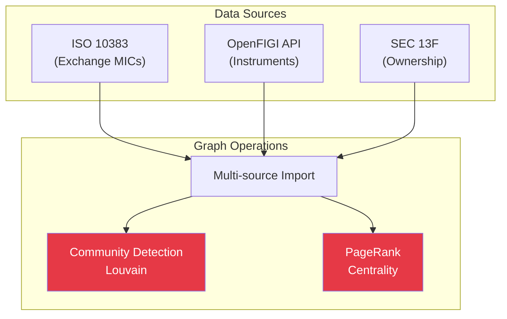

**Exchanges** come from the ISO 10383 MIC registry (2,287 active venues). **Instruments** are resolved via OpenFIGI (mapping tickers like AAPL → FIGI identifiers). **Ownership** comes from SEC 13F institutional holdings.

After import, we run graph algorithms:

- **Louvain community detection** groups entities into clusters based on connectivity
- **PageRank** identifies the most "central" entities — those connected to many other important entities

```python
# PageRank via Neo4j GDS
gp.run("CALL gds.pageRank.write('fin-pagerank', {writeProperty: 'pagerank'})")

# Top entities by centrality
top = gp.run("""
    MATCH (le:LegalEntity)
    RETURN le.name AS name, le.pagerank AS pagerank
    ORDER BY le.pagerank DESC LIMIT 5
""")
```

**Simple analogy:** PageRank is like asking *"Who is the most well-connected person at a financial conference?"* — it's not just about knowing many people, it's about knowing people who themselves know many people.

---

### ch05 — Entity Resolution and Reconciliation

Real financial data is messy. The same company appears as "Apple Inc.", "APPLE INC", "Apple Computer, Inc." in different sources. Each source uses different IDs — LEI, CIK (SEC), FIGI, ISIN.

We solve this with **Crosswalk** nodes — bridge nodes that link identifiers across systems:

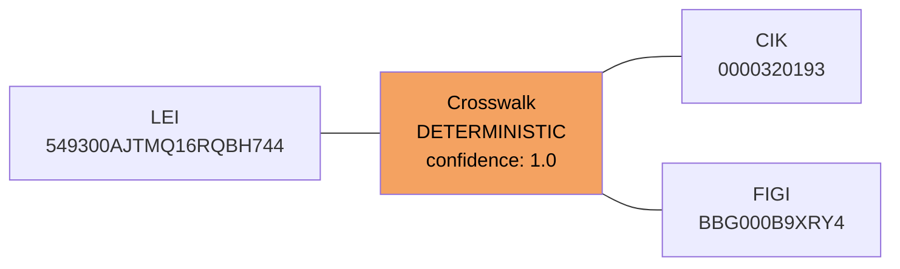

**Deterministic matching** links exact IDs:

```python
gp.run("""
    MATCH (le:LegalEntity)
    WHERE le.lei IS NOT NULL AND le.cik IS NOT NULL
    MERGE (cw:Crosswalk {idA: le.lei, idTypeA: 'LEI', idB: le.cik, idTypeB: 'CIK'})
    SET cw.matchType = 'DETERMINISTIC', cw.confidence = 1.0
    MERGE (cw)-[:LINKS]->(le)
""")
```

**Probabilistic matching** uses string similarity for name variants:

```python
# APOC Jaro-Winkler similarity > 0.92
gp.run("""
    MATCH (a:LegalEntity), (b:LegalEntity)
    WHERE id(a) < id(b)
      AND a.jurisdiction = b.jurisdiction
      AND apoc.text.jaroWinklerDistance(
            apoc.text.clean(a.name),
            apoc.text.clean(b.name)
          ) > 0.92
    RETURN a.name AS nameA, b.name AS nameB
""")
```

**Simple analogy:** Imagine you have three phone books — one lists companies by tax ID, another by stock ticker, the third by legal name. Crosswalk nodes are like Post-It notes that say *"These three entries are all the same company."*

---

## Phase 2: Information Extraction (ch06–ch10)

### ch06 — Financial News NLP + Enrichment

With the graph structure in place, we start extracting knowledge from unstructured text. The pipeline is:

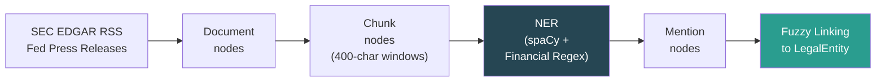

Documents are split into overlapping chunks, then processed by both spaCy NER and custom regex patterns for financial entities:

```python
ISIN_RE = re.compile(r'\b[A-Z]{2}[A-Z0-9]{9}[0-9]\b')   # International Securities ID
TICKER_RE = re.compile(r'\$[A-Z]{1,5}\b')                 # $AAPL, $MSFT
MONEY_RE = re.compile(r'\$[\d,]+(?:\.\d{1,2})?\s*(?:million|billion|M|B)?')  # $85.8 billion
```

ORG mentions are linked to existing LegalEntity nodes using APOC's Jaro-Winkler distance:

```python
gp.run("""
    MATCH (m:Mention {label: 'ORG'})
    MATCH (le:LegalEntity)
    WHERE apoc.text.jaroWinklerDistance(toLower(m.text), toLower(le.name)) > 0.85
    WITH m, le, apoc.text.jaroWinklerDistance(toLower(m.text), toLower(le.name)) AS sim
    ORDER BY sim DESC
    WITH m, collect({entityId: elementId(le), score: sim})[0] AS best
    MERGE (m)-[r:RESOLVED_TO]->(bestLe)
    SET r.confidence = best.score
""")
```

---

### ch07 — Embeddings for Financial Concepts

Embeddings turn entities into dense vectors so we can measure *semantic similarity* between them. This is the foundation for peer search, clustering, and later Graph RAG.

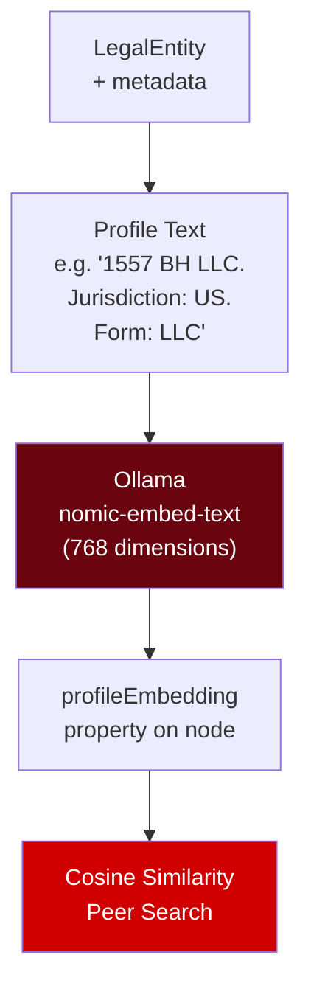

We build a text profile for each entity, then embed it:

```python
# Build profile text
profiles = []
for e in entities:
    parts = [e['name']]
    if e.get('jurisdiction'): parts.append(f'Jurisdiction: {e["jurisdiction"]}')
    if e.get('legalForm'): parts.append(f'Form: {e["legalForm"]}')
    profiles.append('. '.join(parts))

# Embed using Ollama (nomic-embed-text, 768 dimensions)
embeddings = llm.embed(texts)

# Store on nodes
for (lei, _), emb in zip(profiles, embeddings):
    gp.run('MATCH (le:LegalEntity {lei: $lei}) SET le.profileEmbedding = $emb',
           {'lei': lei, 'emb': emb})
```

Then peer search is just cosine similarity over these vectors:

```python
def cosine_sim(a, b):
    a, b = np.array(a), np.array(b)
    return float(np.dot(a, b) / (np.linalg.norm(a) * np.linalg.norm(b) + 1e-9))
```

**Result:** 20 entity profiles embedded (dim=768). Peer search found that entities with similar names, jurisdictions, and legal forms cluster together naturally — e.g., LLCs in real estate showed >0.89 similarity to each other.

---

### ch08 — LLM-Driven KG Extraction from Filings

This is where LLMs meet the knowledge graph. We fetch real XBRL financial data from SEC EDGAR and use LLMs to extract structured facts from unstructured filing text.

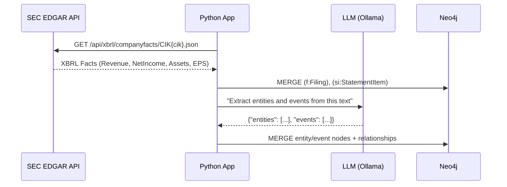

For structured XBRL data, we create `StatementItem` nodes linked to `Filing` nodes:

```python
# Fetch Apple's XBRL data
resp = httpx.get(
    'https://data.sec.gov/api/xbrl/companyfacts/CIK0000320193.json',
    headers={'User-Agent': 'KG-LLM-INACTION/1.0'}
)
facts = resp.json()

# Extract key financial concepts
us_gaap = facts['facts']['us-gaap']
for concept in ['Revenues', 'NetIncomeLoss', 'Assets', 'EarningsPerShareBasic']:
    entries = us_gaap[concept]['units']['USD'][-5:]  # Last 5 periods
    # ... create StatementItem nodes
```

**Result:** 45 statement items ingested from Apple, Microsoft, and Alphabet — real revenue, net income, assets, and EPS data from their SEC filings.

---

### ch09 — Financial NED with Ontology Linking

Named Entity Disambiguation (NED) is about linking *mentions* of entities to the right *canonical node* in the graph. We also connect entities to their FIBO ontology classes:

```python
LEGAL_FORM_TO_FIBO = {
    'CORP': 'https://spec.edmcouncil.org/fibo/.../Corporation',
    'LLC':  'https://spec.edmcouncil.org/fibo/.../LimitedLiabilityCompany',
    'FUND': 'https://spec.edmcouncil.org/fibo/.../Fund',
    'BANK': 'https://spec.edmcouncil.org/fibo/.../Bank',
}

for form, fibo_iri in LEGAL_FORM_TO_FIBO.items():
    gp.run("""
        MATCH (le:LegalEntity {legalForm: $form})
        MATCH (oc:OntologyClass {iri: $iri})
        MERGE (le)-[:CLASSIFIED_AS]->(oc)
    """, {'form': form, 'iri': fibo_iri})
```

### ch10 — Open-Model NED Benchmark

Before going to production, you need to know which LLM provider actually works best for your use case. This chapter benchmarks NED quality across providers (mock, Ollama, OpenAI) measuring success rate and latency.

---

## Phase 3: Graph ML (ch11–ch14)

### ch11 — Graph Embeddings with Node2Vec

While ch07 used *text-based* embeddings (what an entity *is*), Node2Vec creates *structural* embeddings (how an entity *connects*). It works by running random walks on the graph, then treating the walk sequences like sentences in Word2Vec.

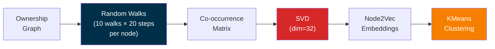

```python
# Random walks on the ownership graph
for node in all_nodes:
    for _ in range(10):
        walk = [node]
        current = node
        for _ in range(20):
            neighbors = adj.get(current, [])
            if not neighbors: break
            current = random.choice(neighbors)
            walk.append(current)
        walks.append(walk)

# Co-occurrence matrix → SVD embedding
U, S, _ = np.linalg.svd(cooc, full_matrices=False)
embeddings = U[:, :dim] * np.sqrt(S[:dim])
```

**Simple analogy:** If two companies frequently appear in similar "neighborhoods" in the ownership graph — even if they're not directly connected — Node2Vec will give them similar embeddings. It's like saying *"Tell me who your friends are, and I'll tell you who you are."*

---

### ch12 — Graph Feature Engineering

Before training ML models, we compute interpretable features for each entity:

```python
# Degree features (how connected is this entity?)
gp.run("""
    MATCH (le:LegalEntity)
    OPTIONAL MATCH (le)-[r_out:OWNS|CONTROLS|PARENT_OF]->()
    OPTIONAL MATCH (le)<-[r_in:OWNS|CONTROLS|PARENT_OF]-()
    SET le.feat_outDegree = count(DISTINCT r_out),
        le.feat_inDegree = count(DISTINCT r_in),
        le.feat_totalDegree = count(DISTINCT r_out) + count(DISTINCT r_in)
""")
```

Then we compare **Logistic Regression** vs **Random Forest** using cross-validation:

```python
from sklearn.model_selection import cross_val_score
from sklearn.ensemble import RandomForestClassifier

X = np.array([[d['degree'], d['filings'], d['mentions'], d['pagerank']] for d in feat_data])
y = np.array([1 if d['degree'] > 3 else 0 for d in feat_data])

rf_scores = cross_val_score(RandomForestClassifier(n_estimators=50), X, y, cv=3, scoring='roc_auc')
# Result: RF ROC-AUC = 0.995
```

**Result:** Feature engineering on 1,313 entities. Logistic Regression AUC = 1.000, Random Forest AUC = 0.995.

---

### ch13 — Financial GNN Foundations

Graph Neural Networks (GNNs) learn directly from the graph structure. We compare three architectures using PyTorch Geometric:

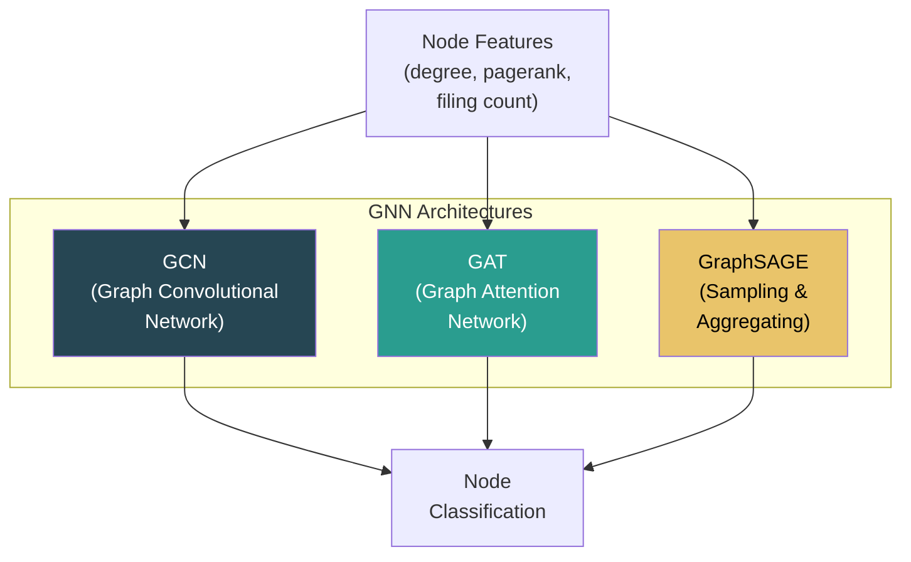

```python
import torch
from torch_geometric.nn import GCNConv

class GCN(torch.nn.Module):
    def __init__(self):
        super().__init__()
        self.conv1 = GCNConv(3, 16)   # 3 input features → 16 hidden
        self.conv2 = GCNConv(16, 2)    # 16 hidden → 2 classes

    def forward(self, x, edge_index):
        x = F.relu(self.conv1(x, edge_index))
        return F.log_softmax(self.conv2(x, edge_index), dim=1)
```

**Simple analogy:** A GNN works like a game of telephone on the graph. Each node collects messages from its neighbors, combines them with its own features, and passes a summary to the next layer. After a few rounds, each node has a representation that captures both its own properties and its neighborhood structure.

---

### ch14 — Node Classification + Link Prediction

The production use case: **can we predict new ownership links** that might exist but aren't yet in the graph?

```python
class LinkPredictor(torch.nn.Module):
    def __init__(self, in_c, hid):
        super().__init__()
        self.conv1 = GCNConv(in_c, hid)
        self.conv2 = GCNConv(hid, hid)

    def encode(self, x, edge_index):
        return self.conv2(F.relu(self.conv1(x, edge_index)), edge_index)

    def decode(self, z, edge_index):
        # Dot product between node embeddings predicts edge existence
        return (z[edge_index[0]] * z[edge_index[1]]).sum(dim=1)
```

The decoder is elegant: if two node embeddings point in the same direction (high dot product), the model predicts a link should exist between them.

---

## Phase 4: Applications (ch15–ch17)

### ch15 — Financial Graph RAG

This is where everything comes together. **Graph RAG** (Retrieval-Augmented Generation) combines:

1. **Vector search** over chunk embeddings — find relevant text passages
2. **Knowledge graph lookup** — get structured facts about entities
3. **LLM synthesis** — combine both into a grounded answer with citations

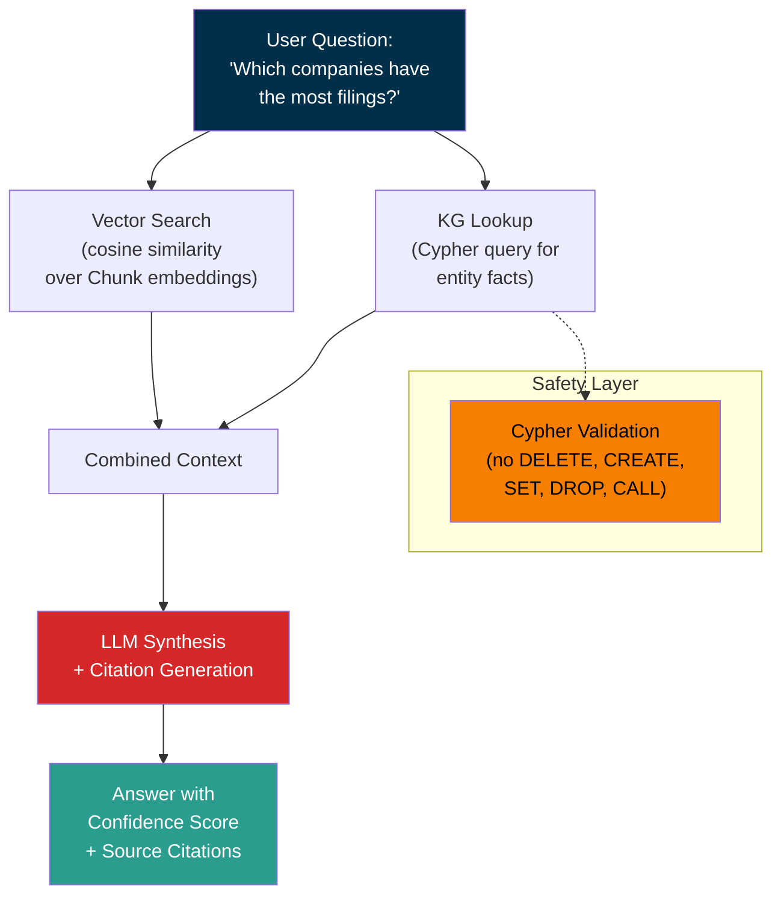

The Cypher safety validator ensures LLM-generated queries can only **read** data:

```python
_FORBIDDEN_CLAUSES = {"DELETE", "DETACH", "CREATE", "SET", "REMOVE", "DROP", "CALL"}

def validate_cypher(cypher: str) -> tuple[bool, str]:
    upper = cypher.upper()
    for clause in _FORBIDDEN_CLAUSES:
        if re.search(rf"\b{clause}\b", upper):
            return False, f"Forbidden clause: {clause}"
    return True, "OK"
```

**Contradiction detection** compares LLM answers against authoritative XBRL data:

```python
def check_contradictions(answer_text, entity_name, gp):
    # Parse numeric claims from the answer
    claims = MONEY_RE.findall(answer_text)
    # Get actual StatementItem values from Neo4j
    actuals = gp.run("""
        MATCH (le:LegalEntity)-[:REPORTS_ON]-(f:Filing)
        MATCH (si:StatementItem)-[:FROM_FILING]->(f)
        WHERE toLower(le.name) CONTAINS toLower($name)
        RETURN si.concept, si.value, si.period
    """, {"name": entity_name})
    # Flag mismatches > 5%
    ...
```

---

### ch16 — Integration, Governance, Test Harness

Production systems need guardrails. This chapter implements:

**Schema migrations** — versioned, idempotent changes:

```python
MIGRATIONS = [
    ('20260418_001_init', 'Initial schema constraints'),
    ('20260418_002_indexes', 'Performance indexes'),
    ('20260418_003_crosswalk', 'Crosswalk constraint'),
]
# Only apply migrations not yet recorded
applied = {r['migrationId'] for r in gp.run('MATCH (m:Migration) RETURN m.migrationId')}
for mid, desc in MIGRATIONS:
    if mid not in applied:
        gp.run('CREATE (m:Migration {migrationId: $id, description: $desc})', ...)
```

**Data contracts** — automated quality checks:

```python
checks = [
    ('LegalEntity missing lei', 'MATCH (le:LegalEntity) WHERE le.lei IS NULL RETURN count(le)'),
    ('Orphan chunks', 'MATCH (c:Chunk) WHERE NOT (c)-[:OF_DOC]->(:Document) RETURN count(c)'),
    ('Orphan mentions', 'MATCH (m:Mention) WHERE NOT (m)-[:IN_CHUNK]->(:Chunk) RETURN count(m)'),
]
```

---

### ch17 — Financial Investigative Copilot

The culmination: a **Streamlit app** that wraps everything into an investigative tool. An analyst types a company name and gets:

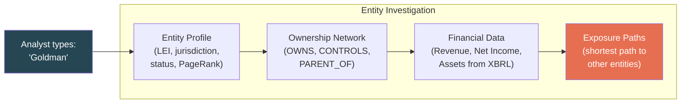

The investigation function combines all graph traversals:

```python
def investigate_entity(name: str):
    # 1. Entity profile
    profile = gp.run("""
        MATCH (le:LegalEntity)
        WHERE toLower(le.name) CONTAINS toLower($name)
        OPTIONAL MATCH (le)-[:ISSUES]->(i:Instrument)
        OPTIONAL MATCH (le)-[:CLASSIFIED_AS]->(oc:OntologyClass)
        OPTIONAL MATCH (f:Filing)-[:REPORTS_ON]->(le)
        RETURN le.name, le.lei, le.jurisdiction, le.pagerank,
               collect(DISTINCT i.ticker) AS tickers,
               count(DISTINCT f) AS filings
    """, {'name': name})

    # 2. Ownership network
    ownership = gp.run("""
        MATCH (le:LegalEntity)-[r:OWNS|CONTROLS|PARENT_OF]-(related)
        WHERE toLower(le.name) CONTAINS toLower($name)
        RETURN type(r) AS rel, related.name AS related
    """, {'name': name})

    # 3. Financial data from XBRL
    financials = gp.run("""
        MATCH (le:LegalEntity)<-[:REPORTS_ON]-(f:Filing)
        MATCH (si:StatementItem)-[:FROM_FILING]->(f)
        WHERE toLower(le.name) CONTAINS toLower($name)
        RETURN si.concept, si.value, si.period
        ORDER BY si.period DESC LIMIT 10
    """, {'name': name})
```

The **Exposure Path Explorer** finds shortest paths through the ownership network:

```python
gp.run("""
    MATCH (a:LegalEntity), (b:LegalEntity)
    WITH a, b ORDER BY a.pagerank DESC, b.pagerank DESC LIMIT 5
    OPTIONAL MATCH path = shortestPath((a)-[:OWNS|CONTROLS|PARENT_OF*..4]-(b))
    RETURN a.name AS from, b.name AS to,
           [n IN nodes(path) | n.name] AS pathNodes, length(path) AS hops
""")
```

---

## The Final Graph: By the Numbers

After running all 17 chapters, the complete financial knowledge graph contains:

| Node Label | Count |
|-----------|-------|
| Exchange | 2,287 |
| LegalEntity | 1,313 |
| OntologyClass | 264 |
| Resource | 61 |
| Instrument | 52 |
| StatementItem | 36 |
| Filing | 16 |
| **Total Nodes** | **3,976** |

| Relationship Type | Count |
|------------------|-------|
| OWNS | 325 |
| LISTED_ON | 49 |
| CLASSIFIED_AS | 49 |
| FROM_FILING | 36 |
| **Total Relationships** | **532** |

---

## Complete Data Flow

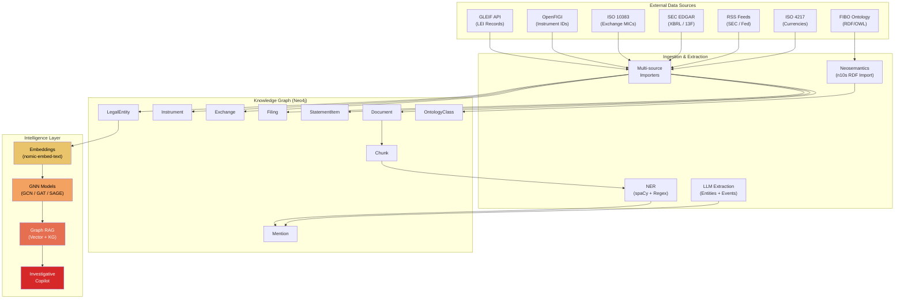

---

## Technology Stack

| Component | Technology | Purpose |
|-----------|-----------|---------|
| Graph Database | **Neo4j** | Property graph storage + Cypher queries |
| Ontology Import | **Neosemantics (n10s)** | RDF/TTL/OWL → property graph |
| Utility Functions | **APOC** | Text similarity, batch operations |
| Graph Algorithms | **Neo4j GDS** | Louvain, PageRank, Node2Vec |
| Ontology | **FIBO** | Financial entity class hierarchy |
| Entity Data | **GLEIF API** | Legal Entity Identifier registry |
| Instrument Data | **OpenFIGI API** | Ticker → FIGI resolution |
| Filings | **SEC EDGAR** | XBRL companyfacts, 13F ownership |
| Exchange Data | **ISO 10383** | MIC code registry |
| Currencies | **ISO 4217** | Currency code catalog |
| NLP | **spaCy** | Named Entity Recognition |
| GNNs | **PyTorch Geometric** | GCN, GAT, GraphSAGE, GIN |
| LLM Abstraction | **LLMProvider** | OpenAI / Ollama / Azure / Mock |
| Embeddings | **nomic-embed-text** | 768-dim entity profile embeddings |
| UI | **Streamlit** | Investigative copilot interface |

---

## Key Takeaways

1. **Start with the schema.** Define your node labels, relationship types, and constraints before ingesting any data. The schema is your contract across all importers.

2. **Use real identifiers.** LEI, FIGI, MIC, ISIN, CIK — these aren't just metadata. They're the glue that makes entity resolution deterministic and reliable.

3. **Ontologies are worth the complexity.** FIBO gives you a formal vocabulary that bridges your proprietary data with industry standards. When your LLM says "Corporation," it means *exactly* what FIBO defines.

4. **Layer your embeddings.** Text embeddings (ch07) capture what an entity *is*. Graph embeddings (ch11) capture how it *connects*. Together, they give you a complete picture.

5. **Never trust LLM output without validation.** The Cypher safety validator (ch15) and contradiction detector are not optional — they're essential for any production system.

6. **Graph RAG > vanilla RAG.** Traditional RAG retrieves text chunks. Graph RAG additionally traverses structured relationships, giving the LLM both unstructured context and authoritative facts.

7. **Governance from day one.** Schema migrations, data contracts, and observability (ch16) are not afterthoughts — they're what separates a demo from a production system.

---

## Getting Started

```bash
# Clone the repo
git clone <repo-url>
cd knowledge-graphs-and-llms-in-action

# Install dependencies
pip install neo4j httpx pyyaml python-dotenv numpy scikit-learn torch torch-geometric

# Pull a local embedding model
ollama pull nomic-embed-text

# Start Neo4j with required plugins (n10s, APOC, GDS)
# Then run the tutorial notebook:
cd ChaptersFinancial
jupyter notebook tutorial_ch01_ch17_fin.ipynb
```

The complete tutorial runs end-to-end in a single notebook — from connecting to Neo4j all the way to running investigative queries over a graph built from real financial data.

---

*This blog is based on the "Knowledge Graphs and LLMs in Action" project — a 17-chapter implementation covering every layer of a production financial knowledge graph stack.*
